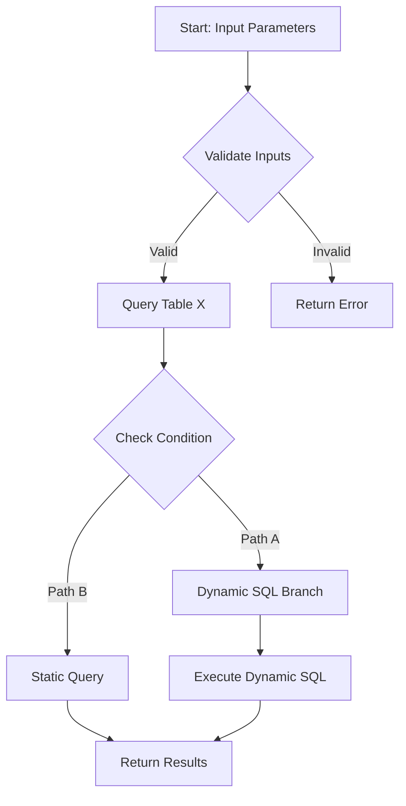
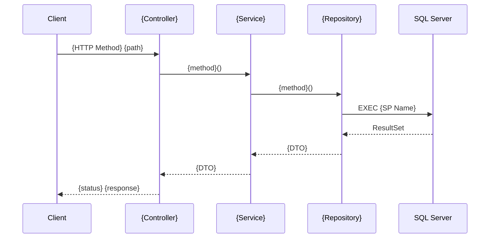
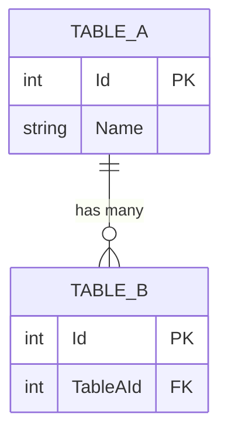

# {SP Name}

> **Auto-generated** | Last analyzed: {DATE} | Status: Draft

## Overview

| Attribute | Value |
|-----------|-------|
| **SP Name** | `{schema}.{name}` |
| **Schema** | `{schema}` |
| **Definition File** | `{file:line}` |
| **Complexity** | {Simple / Moderate / Complex} |
| **Parameters** | {N} IN, {N} OUT |
| **Tables Referenced** | {N} |
| **Lines of SQL** | {N} |
| **Dynamic SQL** | {Yes / No} |
| **Blast Radius** | {Low / Medium / High} — called from {N} .NET locations |

## Purpose

[inferred] {2-3 sentences explaining what this SP does and why it exists, inferred from logic analysis}

## Parameters

| # | Name | Type | Direction | Default | Description [inferred] |
|---|------|------|-----------|---------|----------------------|
| 1 | {name} | {type} | IN | {default or —} | {description} |

## Tables & Views Referenced

| Object | Schema | Operations | JOIN Type | Notes |
|--------|--------|-----------|-----------|-------|
| {table} | {schema} | SELECT | INNER JOIN | {notes} |

## Execution Flow



## .NET Invocation Map



## .NET Invocation Points

| # | Entry Point | Controller | Service | Repository | File |
|---|-------------|-----------|---------|------------|------|
| 1 | {HTTP Method path} | {class.method} | {class.method} | {class.method} | {file:line} |

## Data Model (Tables Used)



## Logic Details

### Dynamic SQL [if present]

```sql
-- Dynamic SQL template extracted from SP
{dynamic SQL pattern with parameter placeholders}
```

**Parameters feeding dynamic SQL**: {list}
**Injection risk**: {assessment}

### Conditional Paths

| Condition | Path | Tables Affected | Notes |
|-----------|------|----------------|-------|
| {condition} | {A} | {tables} | {notes} |

### SP Dependencies

| Called SP | Purpose [inferred] | Conditional? |
|----------|-------------------|-------------|
| {sp_name} | {purpose} | {Yes/No — under what condition} |

### Temp Tables / Table Variables

| Name | Type | Created At | Used For [inferred] | Dropped At |
|------|------|-----------|---------------------|-----------|
| {name} | {#temp / @var} | {line} | {purpose} | {line or implicit} |

## Optimization Opportunities [inferred]

- {Index suggestion based on JOIN/WHERE patterns}
- {Query restructuring suggestion}
- {Redundant operation flagged}
- {N+1 query pattern detected}

## Risk Assessment

| Risk Factor | Level | Details |
|-------------|-------|---------|
| Blast radius | {Low/Med/High} | Called from {N} places |
| Dynamic SQL | {Low/Med/High} | {details} |
| Data sensitivity | {Low/Med/High} | {what data is affected} |
| Regression risk | {Low/Med/High} | {assessment} |

## Git History

| Metric | Value |
|--------|-------|
| Last modified | {date} — `{commit hash}` "{message}" |
| Change frequency | {N} commits in last {period} |
| Contributors | {names} |

## Warnings & Quirks

- [inferred] {Any unusual patterns, potential issues, or tech debt}
- [?] {Items needing developer investigation or runtime validation}

---

## Review Checklist

- [ ] Purpose correctly described
- [ ] Parameters match actual SP signature
- [ ] Tables and operations accurate
- [ ] Execution flow matches actual logic
- [ ] All .NET invocation points found
- [ ] Blast radius correctly assessed
- [ ] Optimization suggestions reviewed
- [ ] `[inferred]` items validated
- [ ] `[?]` items investigated
