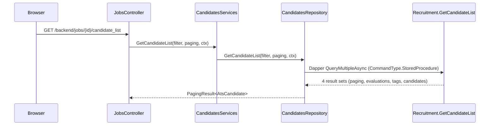
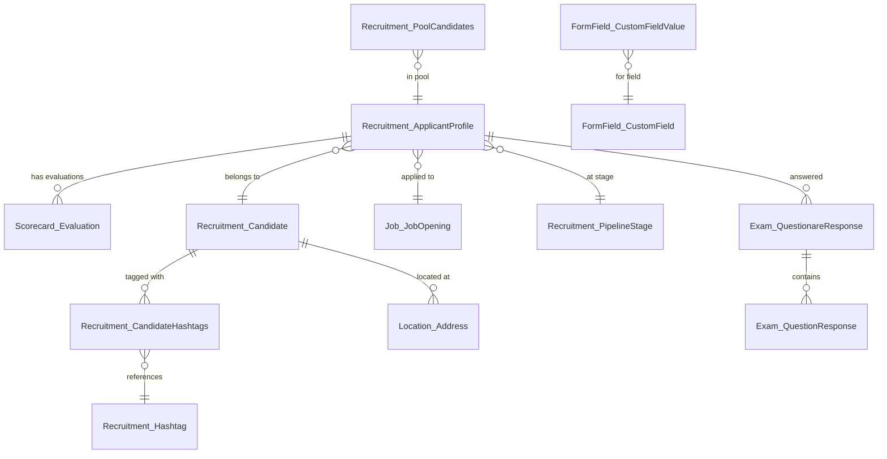

# SP Analysis: Recruitment.GetCandidateList

> Auto-generated | Status: Draft | Validation: `[inferred]` items need developer confirmation

## Blast Radius

**Rating: Medium** — single caller chain, but 710-line SP touching 10+ tables across 6 schemas

### Call Chain

```
Browser: GET /backend/jobs/{id}/candidate_list
    → JobsController.GetCandidateList()                    [line 262]
        → CandidatesServices.GetCandidateList()            [line 2698]
            → CandidatesRepository.GetCandidateList()      [line 2462]
                → Dapper QueryMultipleAsync                [line 2553]
                    → Recruitment.GetCandidateList (SP)
```

### Invocation Map



### .NET References

| Layer | File | Method | Line |
|-------|------|--------|------|
| Controller | `core/Adopto.Client.Web.Api/Controllers/Backend/App/JobsController.cs` | `GetCandidateList` | 262 |
| Service (interface) | `core/Adopto.Services.Api/Services/ICandidatesServices.cs` | `GetCandidateList` | 91 |
| Service (impl) | `core/Adopto.Services.Api/ServiceProviders/CandidatesServices.cs` | `GetCandidateList` | 2698 |
| Repository (interface) | `core/Adopto.DataLayer.Api/Interfaces/ICandidatesRepository.cs` | `GetCandidateList` | 78 |
| Repository (impl) | `core/Adopto.DataLayer.Api/Repositories/CandidatesRepository.cs` | `GetCandidateList` | 2462 |

### Cross-SP Dependencies

- **Called by other SPs**: None
- **Calls other SPs**: None
- **Functions used**: `Roles.GetJobsForUser()`, `Roles.GetApplicantsForUser()` (security)

---

## Parameters (18)

| Name | Type | Direction | Default | Description |
|------|------|-----------|---------|-------------|
| `@personalProfileId` | uniqueidentifier | IN | — | Current user's personal profile `[inferred]` |
| `@recruitmentProfileId` | uniqueidentifier | IN | — | Company/tenant ID `[inferred]` |
| `@tags` | dbo.ListStrings (TVP) | IN | READONLY | Hashtag filter values |
| `@answers` | dbo.ListIntegers (TVP) | IN | READONLY | Screening question answer filter |
| `@sourceTypes` | dbo.ListIntegers (TVP) | IN | READONLY | Candidate source type filter |
| `@reasons` | dbo.ListIntegers (TVP) | IN | READONLY | Disqualification reason filter |
| `@customFieldOptions` | dbo.ListIntegers (TVP) | IN | READONLY | Custom field option filter |
| `@pools` | dbo.ListIntegers (TVP) | IN | READONLY | Candidate pool filter |
| `@job` | int | IN | — | Job opening ID |
| `@stage` | int | IN | NULL | Pipeline stage filter |
| `@disqualified` | bit | IN | 0 | Show disqualified candidates |
| `@query` | nvarchar(2000) | IN | NULL | Full-text search query |
| `@sort` | int | IN | — | Sort mode (1=date ASC, 2=date DESC, 3=rating, 5=name ASC, 6=name DESC, 7=ranking) |
| `@pageSize` | int | IN | 50 | Page size |
| `@page` | int | IN | 1 | Page number |
| `@applicantId` | int | IN | NULL | Jump to specific applicant's page |

---

## Tables & Views Referenced

| Object | Schema | Operations | Notes |
|--------|--------|-----------|-------|
| `ApplicantProfile` | Recruitment | SELECT | Core table — candidate applications per job |
| `Candidate` | Recruitment | SELECT + CONTAINSTABLE (FTS) | Full-text search on FullName, Company, Title |
| `Hashtag` | Recruitment | SELECT | Tag filtering |
| `CandidateHashtags` | Recruitment | SELECT | Candidate-tag junction |
| `PipelineStage` | Recruitment | SELECT | Recruitment pipeline stages |
| `DisqualifyReason` | Recruitment | SELECT | DQ reason lookup |
| `PoolCandidates` | Recruitment | SELECT | Pool membership |
| `Employee` | Recruitment | SELECT | Referral source |
| `JobOpening` | Job | SELECT | Job metadata (pipeline ID) |
| `Evaluation` | Scorecard | SELECT | Candidate ratings per stage |
| `CustomFieldValue` | FormField | SELECT | Custom field filters |
| `CustomField` | FormField | SELECT | Field type metadata |
| `QuestionareResponse` | Exam | SELECT | Screening answers |
| `QuestionResponse` | Exam | SELECT | Answer details |
| `CodeData` | Codes | SELECT | Source channel/type codes |
| `AdoptoPersonalProfile` | Profile | SELECT | Recruiter/sourcer name |
| `Address` | Location | SELECT | Candidate location |

### ER Diagram (tables referenced)



---

## Logic Structure

### Execution Flow

```mermaid
flowchart TD
    A[Start] --> B{User has access?}
    B -->|No| C[THROW 50403 Forbidden]
    B -->|Yes| D[Load hashtags, pipeline stages]
    D --> E[Apply CF + Pool filters]
    E --> F{@query provided?}
    F -->|Yes| G[Full-text search path]
    F -->|No| H[Standard filter path]
    G --> I{Hashtag + Answer combo?}
    H --> I
    I -->|None| J1[Base query]
    I -->|Tags only| J2[+ hashtag JOIN]
    I -->|Answers only| J3[+ answer JOIN]
    I -->|Both| J4[+ both JOINs]
    J1 & J2 & J3 & J4 --> K[Page results]
    K --> L{@applicantId?}
    L -->|Yes| M[Calculate page for applicant]
    L -->|No| N[Standard OFFSET/FETCH]
    M & N --> O[Return 4 result sets]
```

### Conditional Paths (8 total)

The SP has a **2x4 matrix** of execution paths:
- **Outer branch**: `@query IS NOT NULL` (with full-text search) vs `@query IS NULL` (without)
- **Inner branch**: 4 filter combinations per outer:
  1. No hashtags, no answers
  2. Hashtags only
  3. Answers only
  4. Both hashtags and answers

Each path produces identical output but with different JOIN chains. This is significant code duplication (~400 lines of nearly identical SELECT blocks).

### Sort Modes

| @sort | Order |
|-------|-------|
| 1 | Date applied ASC |
| 2 | Date applied DESC |
| 3 | Rating score DESC (weighted: DefinitelyYes=100, Yes=1, No=-1, DefinitelyNo=-100) |
| 5 | First name ASC |
| 6 | First name DESC |
| 7 | Ranking score DESC |

---

## Output (4 Result Sets)

The SP returns 4 result sets via `QueryMultipleAsync`:

1. **Paging metadata**: `Count`, `Page`, `PerPage`
2. **Evaluations**: Per-stage scorecard ratings (`ApplicationId`, `PipelineStageId`, `DefinitelyNo`, `No`, `Yes`, `DefinitelyYes`)
3. **Tags**: Hashtags per candidate (`Tag`, `CandidateId`)
4. **Candidate details**: Full record (`Id`, `Name`, `Avatar`, `Created`, `SnoozedUntil`, `ApplicationId`, `StageName`, `Company`, `Title`, `Address`, `Disqualified`, `DisqualificationReason`, `DisqualifiedAt`, `PipelineStageId`, `PreviousPipelineStageId`, `SourceFormatted`)

---

## Temp Tables

| Name | Columns | Lifecycle |
|------|---------|-----------|
| `#cfApplicants` | `Id INT` | Custom field filter results, populated if CF filters exist |
| `#poolsApplicants` | `Id INT` | Pool filter results, populated if pool filters exist |
| `#myApplicants` | `Id INT` | Role-filtered applicant IDs (intersection of CF + pool + role filters) |
| `#tempCandidates` | `CandidateId, ApplicationId, Counter, Disqualified, DisqualifyReasonId` | All matching candidates pre-paging |
| `#temp` | `ApplicationId PK, CandidateId, Counter` | Final paged result set |
| `#temp2` | `CandidateId, ApplicationId, Counter` | Used only when `@applicantId` is set — calculates which page the applicant is on |

---

## Complexity

**Rating: XL**

| Factor | Value |
|--------|-------|
| Lines | 710 |
| Parameters | 18 (including 6 table-valued parameters) |
| Execution paths | 8 (2x4 matrix) |
| Tables referenced | 10+ across 6 schemas |
| Result sets | 4 |
| Temp tables | 6 |
| Security functions | 2 (`Roles.GetJobsForUser`, `Roles.GetApplicantsForUser`) |
| Full-text search | Yes (`CONTAINSTABLE`) |

---

## Risks & Observations

- **Code duplication**: 8 nearly-identical SELECT blocks could be refactored to a single query with conditional JOINs — would reduce ~400 lines to ~80 `[inferred]`
- **Full-text search dependency**: `CONTAINSTABLE` requires full-text index on `Recruitment.Candidate` (FullName, Company, Title) — ensure index exists before testing
- **Security functions**: `Roles.GetJobsForUser` and `Roles.GetApplicantsForUser` enforce row-level security — changes here affect access control
- **Pagination math**: The `@applicantId` page-jump logic (lines 533-614) contains inline comments in Croatian explaining the offset calculation — be careful modifying pagination
- **Sort mode gap**: Sort modes 4 is unused (1,2,3 then jumps to 5,6,7) `[?]`
- **TVP dependencies**: 6 table-valued parameters use `dbo.ListStrings` and `dbo.ListIntegers` user-defined types — these must exist in the database

---

## Changelog

- `[2026-03-18]` Initial analysis generated by SP Analysis Workflow (demo run)
